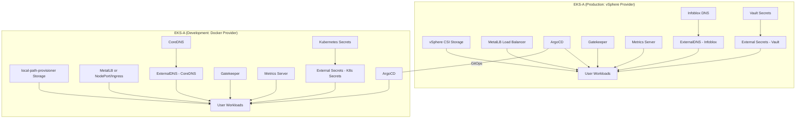

# EKS-A Architecture: Production (vSphere) & Development (Docker) Environments

## High-Level Architecture Diagram

## Component Mapping Table

| Component/Addon              | EKS-A (vSphere)                | EKS-A (Docker)                | Notes                                      |
|------------------------------|---------------------------------|-------------------------------|--------------------------------------------|
| Storage                      | vSphere CSI                     | local-path-provisioner        | Storage backend differs by provider        |
| DNS                          | Infoblox (ExternalDNS)          | CoreDNS (ExternalDNS)         | ExternalDNS configured per provider        |
| Secrets                      | Vault (External Secrets)        | Kubernetes Secrets            | Use External Secrets for Vault integration |
| Load Balancer                | MetalLB                         | MetalLB or NodePort/Ingress   | MetalLB can be used in both, or NodePort   |
| ArgoCD, Gatekeeper, Metrics  | Same (cloud-agnostic)           | Same                          | No change                                  |
| Cluster Autoscaler           | vSphere/Bare Metal Autoscaler   | N/A or manual scaling         | Optional, depends on infra                 |

## Architecture Summary

- **Both environments use EKS-A** for cluster lifecycle management.
- **Production** runs on vSphere, using vSphere CSI, Infoblox DNS, Vault, and MetalLB.
- **Development** runs on Docker, using local-path-provisioner, CoreDNS, Kubernetes secrets, and MetalLB or NodePort.
- **ArgoCD** is installed via Terraform and manages infrastructure deployment in both environments, with applications managed by ArgoCD.
- **Policy & Metrics:** Gatekeeper and Metrics Server are deployed in both environments.
- **Flexibility:** The architecture supports overlays (via Kustomize/Helm) to adapt manifests for each provider.

## Environment-Specific Overlays

- Use Kustomize or Helm values to manage differences (e.g., storage class, DNS provider, secrets backend).
- ArgoCD applications can reference overlays for prod/dev as needed.

## Infrastructure Management

Infrastructure components are now managed through ArgoCD applications rather than Terraform. This provides better GitOps compliance and allows for easier management of these components.

### Components Managed by ArgoCD

The following infrastructure components are now managed by ArgoCD through Kubernetes manifests:

1. **cert-manager**: Certificate management for TLS certificates
2. **External Secrets Operator**: Secret management integration with external secret stores
3. **local-path-provisioner**: Storage provisioner for development environments
4. **Namespaces**: Required Kubernetes namespaces for the components

These components are deployed through the `apps/infrastructure/` directory which is managed by ArgoCD.

---

**This document is intended for team review and discussion before implementation.**